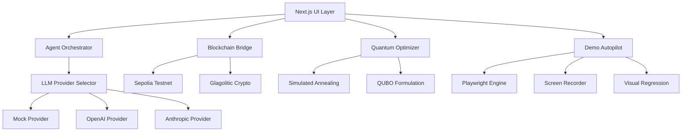

# Yana.Diia Critical Path - Design Document

## System Overview

The Yana.Diia Critical Path Implementation is a production-grade system for AI-powered generation of Ukrainian government digital services. The system integrates LLM providers, AI agent orchestration, blockchain audit trails, quantum-inspired optimization, and automated demo execution.

### High-Level Architecture



### Technology Stack

- **Frontend:** Next.js 16 (App Router), React 19, TypeScript 5.7
- **Styling:** Tailwind CSS 3.4.15, Diia Design System
- **State:** Zustand 5.0.2
- **LLM:** OpenAI SDK 4.78.0, Anthropic SDK 0.32.1
- **Blockchain:** ethers.js 6.x, Sepolia testnet
- **Testing:** fast-check (property-based), Playwright (E2E)
- **Automation:** Playwright, OBS/FFmpeg (recording)

---

## Component Design

### 1. LLM Provider Infrastructure

#### 1.1 Provider Interface

```typescript
// lib/llm/types.ts
export interface LLMProvider {
  name: string
  call(prompt: string, options?: CallOptions): Promise<LLMResponse>
  estimateCost(prompt: string): number
  isAvailable(): Promise<boolean>
}

export interface CallOptions {
  maxTokens?: number
  temperature?: number
  systemPrompt?: string
  timeout?: number
}

export interface LLMResponse {
  text: string
  tokensUsed: number
  latency: number
  provider: string
  cached: boolean
}
```

#### 1.2 Mock Provider

**Responsibilities:**
- Zero-cost LLM simulation for development
- Realistic responses with Ukrainian cultural context
- Deterministic behavior for testing
- 1-2 second latency simulation

**Implementation:**

```typescript
// lib/llm/providers/mock.ts
export class MockProvider implements LLMProvider {
  name = 'mock'
  private responses: Map<string, string[]>
  
  constructor() {
    this.responses = this.loadResponses()
  }
  
  async call(prompt: string, options?: CallOptions): Promise<LLMResponse> {
    const delay = 1000 + Math.random() * 1000 // 1-2s
    await new Promise(r => setTimeout(r, delay))
    
    const response = this.generateResponse(prompt, options)
    
    return {
      text: response,
      tokensUsed: 0,
      latency: delay,
      provider: 'mock',
      cached: false
    }
  }
  
  private generateResponse(prompt: string, options?: CallOptions): string {
    // Extract agent ID from systemPrompt
    const agentId = this.extractAgentId(options?.systemPrompt)
    
    // Get agent-specific responses
    const agentResponses = this.responses.get(agentId) || []
    
    // Return random response with variation
    return agentResponses[Math.floor(Math.random() * agentResponses.length)]
  }
  
  private loadResponses(): Map<string, string[]> {
    // Pre-defined responses for each agent
    return new Map([
      ['zelenskyy', [
        'Всім привіт! Дивіться, це має бути швидко і зручно. Коли реліз?',
        'Добре, але треба простіше. Моя бабуся має розуміти.',
        'Це держава у смартфоні. Давайте запускати!'
      ]],
      ['lesya', [
        'Contra spem spero! Але чи зручно це для простої людини?',
        'Я бачу тут гарні кольори, але шрифт замалий.',
        'Де тут душа? Де емпатія до громадян?'
      ]],
      // ... more agents
    ])
  }
}
```

**Error Handling:**
- Always succeeds (no network errors)
- Validates input (non-empty prompt)
- Logs all calls for debugging

**Performance:**
- Response time: 1-2 seconds (simulated)
- Memory: <10MB (pre-loaded responses)
- CPU: Negligible


#### 1.3 OpenAI Provider

**Responsibilities:**
- Integration with OpenAI API (GPT-4 Turbo, GPT-3.5)
- Token tracking and cost estimation
- Retry logic with exponential backoff
- Fallback to mock on failure

**Implementation:**

```typescript
// lib/llm/providers/openai.ts
import OpenAI from 'openai'

export class OpenAIProvider implements LLMProvider {
  name = 'openai'
  private client: OpenAI
  private model: string
  
  constructor(apiKey: string, model = 'gpt-4-turbo-preview') {
    this.client = new OpenAI({ apiKey })
    this.model = model
  }
  
  async call(prompt: string, options?: CallOptions): Promise<LLMResponse> {
    const startTime = Date.now()
    
    try {
      const completion = await this.client.chat.completions.create({
        model: this.model,
        messages: [
          { role: 'system', content: options?.systemPrompt || '' },
          { role: 'user', content: prompt }
        ],
        max_tokens: options?.maxTokens || 500,
        temperature: options?.temperature || 0.7,
      }, {
        timeout: options?.timeout || 30000
      })
      
      return {
        text: completion.choices[0].message.content || '',
        tokensUsed: completion.usage?.total_tokens || 0,
        latency: Date.now() - startTime,
        provider: 'openai',
        cached: false
      }
    } catch (error) {
      console.error('OpenAI API error:', error)
      throw error
    }
  }
  
  estimateCost(prompt: string): number {
    // GPT-4 Turbo: $0.01/1K input, $0.03/1K output
    const inputTokens = Math.ceil(prompt.length / 4)
    const outputTokens = 500 // max_tokens
    return (inputTokens * 0.01 + outputTokens * 0.03) / 1000
  }
  
  async isAvailable(): Promise<boolean> {
    try {
      await this.client.models.retrieve('gpt-4-turbo-preview')
      return true
    } catch {
      return false
    }
  }
}
```

**Error Handling:**
- Timeout after 30 seconds
- Retry once with 2-second delay
- Fallback to mock provider
- Log all errors to console

**Performance:**
- Response time: 2-10 seconds (API dependent)
- Cost: ~$0.02 per debate (7 agents × 500 tokens)
- Rate limit: 10 RPM (dev), 100 RPM (prod)


#### 1.4 Anthropic Provider

**Responsibilities:**
- Integration with Anthropic API (Claude 3.5 Sonnet)
- Streaming support for long responses
- Cost tracking
- Fallback to mock on failure

**Implementation:**

```typescript
// lib/llm/providers/anthropic.ts
import Anthropic from '@anthropic-ai/sdk'

export class AnthropicProvider implements LLMProvider {
  name = 'anthropic'
  private client: Anthropic
  private model: string
  
  constructor(apiKey: string, model = 'claude-3-5-sonnet-20241022') {
    this.client = new Anthropic({ apiKey })
    this.model = model
  }
  
  async call(prompt: string, options?: CallOptions): Promise<LLMResponse> {
    const startTime = Date.now()
    
    try {
      const message = await this.client.messages.create({
        model: this.model,
        max_tokens: options?.maxTokens || 1024,
        system: options?.systemPrompt || '',
        messages: [
          { role: 'user', content: prompt }
        ],
        temperature: options?.temperature || 0.7,
      })
      
      const text = message.content
        .filter(block => block.type === 'text')
        .map(block => block.text)
        .join('\n')
      
      return {
        text,
        tokensUsed: message.usage.input_tokens + message.usage.output_tokens,
        latency: Date.now() - startTime,
        provider: 'anthropic',
        cached: false
      }
    } catch (error) {
      console.error('Anthropic API error:', error)
      throw error
    }
  }
  
  estimateCost(prompt: string): number {
    // Claude 3.5 Sonnet: $3/MTok input, $15/MTok output
    const inputTokens = Math.ceil(prompt.length / 4)
    const outputTokens = 1024
    return (inputTokens * 3 + outputTokens * 15) / 1000000
  }
  
  async isAvailable(): Promise<boolean> {
    try {
      await this.client.messages.create({
        model: this.model,
        max_tokens: 1,
        messages: [{ role: 'user', content: 'test' }]
      })
      return true
    } catch {
      return false
    }
  }
}
```

**Performance:**
- Response time: 3-8 seconds
- Cost: ~$0.05 per debate
- Rate limit: 50 RPM


#### 1.5 Provider Selector

**Responsibilities:**
- Select provider based on LLM_MODE environment variable
- Implement retry logic with fallback
- Track token usage across providers
- Expose unified interface to application

**Implementation:**

```typescript
// lib/llm/provider-selector.ts
import { MockProvider } from './providers/mock'
import { OpenAIProvider } from './providers/openai'
import { AnthropicProvider } from './providers/anthropic'

export class ProviderSelector {
  private providers: Map<string, LLMProvider>
  private currentMode: string
  private stats: {
    tokensUsed: number
    requestCount: number
    totalLatency: number
  }
  
  constructor() {
    this.providers = new Map()
    this.currentMode = process.env.LLM_MODE || 'mock'
    this.stats = { tokensUsed: 0, requestCount: 0, totalLatency: 0 }
    
    // Initialize providers
    this.providers.set('mock', new MockProvider())
    
    if (process.env.OPENAI_API_KEY) {
      this.providers.set('openai', new OpenAIProvider(process.env.OPENAI_API_KEY))
    }
    
    if (process.env.ANTHROPIC_API_KEY) {
      this.providers.set('anthropic', new AnthropicProvider(process.env.ANTHROPIC_API_KEY))
    }
  }
  
  async call(prompt: string, options?: CallOptions): Promise<LLMResponse> {
    const provider = this.providers.get(this.currentMode)
    
    if (!provider) {
      console.warn(`Provider ${this.currentMode} not available, falling back to mock`)
      return this.providers.get('mock')!.call(prompt, options)
    }
    
    try {
      const response = await this.callWithRetry(provider, prompt, options)
      this.updateStats(response)
      return response
    } catch (error) {
      console.error(`Provider ${this.currentMode} failed, falling back to mock`)
      const mockResponse = await this.providers.get('mock')!.call(prompt, options)
      this.updateStats(mockResponse)
      return mockResponse
    }
  }
  
  private async callWithRetry(
    provider: LLMProvider,
    prompt: string,
    options?: CallOptions,
    retries = 1
  ): Promise<LLMResponse> {
    try {
      return await provider.call(prompt, options)
    } catch (error) {
      if (retries > 0) {
        await new Promise(r => setTimeout(r, 2000))
        return this.callWithRetry(provider, prompt, options, retries - 1)
      }
      throw error
    }
  }
  
  private updateStats(response: LLMResponse) {
    this.stats.tokensUsed += response.tokensUsed
    this.stats.requestCount += 1
    this.stats.totalLatency += response.latency
  }
  
  getStats() {
    return {
      ...this.stats,
      averageLatency: this.stats.requestCount > 0 
        ? this.stats.totalLatency / this.stats.requestCount 
        : 0
    }
  }
  
  setMode(mode: string) {
    if (this.providers.has(mode)) {
      this.currentMode = mode
    }
  }
}

// Singleton instance
export const providerSelector = new ProviderSelector()
```

**Error Handling:**
- Primary provider fails → Retry once
- Retry fails → Fallback to mock
- Mock fails → Throw error (should never happen)

**State Management:**
- Stats stored in memory
- Exposed via getStats() for Dev Panel
- Reset on page reload


---

### 2. AI Debate Chamber

#### 2.1 Agent Orchestrator

**Responsibilities:**
- Sequential execution of 7 AI agents
- Context building from service data
- Response validation (catchphrase presence)
- State management for debate flow

**Implementation:**

```typescript
// lib/debate/orchestrator.ts
import { AI_AGENTS, AgentPersona } from '@/config/ai-agents'
import { providerSelector } from '@/lib/llm/provider-selector'

export interface DebateContext {
  serviceName: string
  flowSteps: string[]
  userStory: string
}

export interface DebateMessage {
  id: string
  agentId: string
  text: string
  timestamp: string
}

export class AgentOrchestrator {
  private agents: AgentPersona[]
  
  constructor() {
    this.agents = AI_AGENTS
  }
  
  async runDebate(
    context: DebateContext,
    onMessage: (msg: DebateMessage) => void,
    onAgentStart: (agentId: string) => void
  ): Promise<DebateMessage[]> {
    const messages: DebateMessage[] = []
    
    for (const agent of this.agents) {
      onAgentStart(agent.id)
      
      const prompt = this.buildPrompt(agent, context, messages)
      const response = await providerSelector.call(prompt, {
        systemPrompt: agent.systemPrompt,
        maxTokens: 200,
        temperature: 0.8
      })
      
      // Validate response contains catchphrase
      const validatedText = this.validateResponse(response.text, agent)
      
      const message: DebateMessage = {
        id: `${agent.id}-${Date.now()}`,
        agentId: agent.id,
        text: validatedText,
        timestamp: new Date().toISOString()
      }
      
      messages.push(message)
      onMessage(message)
      
      // Small delay for UX
      await new Promise(r => setTimeout(r, 500))
    }
    
    return messages
  }
  
  private buildPrompt(
    agent: AgentPersona,
    context: DebateContext,
    previousMessages: DebateMessage[]
  ): string {
    const contextStr = `
Service: ${context.serviceName}
Steps: ${context.flowSteps.join(' → ')}
User Story: ${context.userStory}
    `.trim()
    
    const historyStr = previousMessages.length > 0
      ? '\n\nПопередні коментарі:\n' + previousMessages.map(m => {
          const prevAgent = this.agents.find(a => a.id === m.agentId)
          return `${prevAgent?.name}: ${m.text}`
        }).join('\n')
      : ''
    
    return `${contextStr}${historyStr}\n\nТвоя оцінка (${agent.role}):`
  }
  
  private validateResponse(text: string, agent: AgentPersona): string {
    // Check if response contains at least one catchphrase
    const hasCatchphrase = agent.catchphrases.some(phrase => 
      text.toLowerCase().includes(phrase.toLowerCase())
    )
    
    if (!hasCatchphrase) {
      // Append random catchphrase
      const randomPhrase = agent.catchphrases[
        Math.floor(Math.random() * agent.catchphrases.length)
      ]
      return `${text} ${randomPhrase}`
    }
    
    return text
  }
}

export const agentOrchestrator = new AgentOrchestrator()
```

**Data Flow:**

```
User clicks "Почати Дебати"
  ↓
DebateRoom.startDebate()
  ↓
AgentOrchestrator.runDebate(context)
  ↓
For each agent (sequential):
  ↓
  buildPrompt(agent, context, history)
  ↓
  providerSelector.call(prompt, systemPrompt)
  ↓
  validateResponse(text, agent)
  ↓
  onMessage(message) → UI update
  ↓
  onAgentStart(nextAgent) → Avatar highlight
  ↓
Return all messages
```

**Error Handling:**
- LLM call fails → Fallback to mock
- Response validation fails → Append catchphrase
- Timeout → Skip agent, continue with next


---

### 3. Blockchain Audit Trail

#### 3.1 Glagolitic Cryptography

**Responsibilities:**
- SHA-256 hashing of flow data
- Glagolitic visual representation
- Unicode mapping (U+2C00–U+2C5F)

**Implementation:**

```typescript
// lib/blockchain/glagolitic-crypto.ts
export interface GlagoliticSignature {
  hash: string
  glagolitic: string
  timestamp: number
}

const GLAGOLITIC_MAP: Record<string, string> = {
  '0': 'Ⰰ', '1': 'Ⰱ', '2': 'Ⰲ', '3': 'Ⰳ',
  '4': 'Ⰴ', '5': 'Ⰵ', '6': 'Ⰶ', '7': 'Ⰷ',
  '8': 'Ⰸ', '9': 'Ⰹ', 'a': 'Ⰺ', 'b': 'Ⰻ',
  'c': 'Ⰼ', 'd': 'Ⰽ', 'e': 'Ⰾ', 'f': 'Ⰿ'
}

export async function createGlagoliticSignature(
  data: { text: string }
): Promise<GlagoliticSignature> {
  // SHA-256 hash
  const encoder = new TextEncoder()
  const dataBuffer = encoder.encode(data.text)
  const hashBuffer = await crypto.subtle.digest('SHA-256', dataBuffer)
  const hashArray = Array.from(new Uint8Array(hashBuffer))
  const hash = hashArray.map(b => b.toString(16).padStart(2, '0')).join('')
  
  // Convert to Glagolitic
  const glagolitic = hash
    .split('')
    .map(char => GLAGOLITIC_MAP[char] || char)
    .join('')
  
  return {
    hash,
    glagolitic,
    timestamp: Date.now()
  }
}

export function toGlagolitic(hex: string): string {
  return hex
    .split('')
    .map(char => GLAGOLITIC_MAP[char.toLowerCase()] || char)
    .join('')
}
```

#### 3.2 Blockchain Bridge

**Responsibilities:**
- Connect to Sepolia testnet
- Call smart contract recordFlow()
- Monitor transaction status
- Display Etherscan link

**Implementation:**

```typescript
// lib/blockchain/bridge.ts
import { ethers } from 'ethers'
import { TRANSPARENT_CONTRACT_ABI, SEPOLIA_CONTRACT_ADDRESS } from './constants'

export class BlockchainBridge {
  private provider: ethers.JsonRpcProvider
  private contract: ethers.Contract
  
  constructor() {
    this.provider = new ethers.JsonRpcProvider(
      process.env.NEXT_PUBLIC_SEPOLIA_RPC_URL || 'https://sepolia.infura.io/v3/YOUR_KEY'
    )
    this.contract = new ethers.Contract(
      SEPOLIA_CONTRACT_ADDRESS,
      TRANSPARENT_CONTRACT_ABI,
      this.provider
    )
  }
  
  async recordFlow(
    flowId: string,
    brdHash: string,
    ipfsCid: string,
    description: string
  ): Promise<string> {
    // Estimate gas
    const gasEstimate = await this.contract.recordFlow.estimateGas(
      flowId, brdHash, ipfsCid, description
    )
    
    // Send transaction (requires wallet)
    const signer = await this.getSigner()
    const contractWithSigner = this.contract.connect(signer)
    
    const tx = await contractWithSigner.recordFlow(
      flowId, brdHash, ipfsCid, description,
      { gasLimit: gasEstimate * 120n / 100n } // 20% buffer
    )
    
    // Wait for confirmation
    await tx.wait()
    
    return tx.hash
  }
  
  async verifyFlow(flowId: string): Promise<boolean> {
    return await this.contract.verifyFlow(flowId)
  }
  
  async getFlow(flowId: string): Promise<any> {
    return await this.contract.getFlow(flowId)
  }
  
  private async getSigner(): Promise<ethers.Signer> {
    // For demo: use private key from env
    // For production: use MetaMask or WalletConnect
    const privateKey = process.env.SEPOLIA_PRIVATE_KEY
    if (!privateKey) {
      throw new Error('SEPOLIA_PRIVATE_KEY not set')
    }
    return new ethers.Wallet(privateKey, this.provider)
  }
}

export const blockchainBridge = new BlockchainBridge()
```

**Error Handling:**
- RPC connection fails → Show error, allow retry
- Gas estimation fails → Use default 100k gas
- Transaction reverts → Parse revert reason, display to user
- Timeout (>60s) → Show pending TX hash, continue demo


---

### 4. Quantum Flow Optimizer

#### 4.1 Simulated Annealing

**Responsibilities:**
- Optimize flow step order and count
- Minimize energy function (QUBO)
- Generate 3 variants (Minimal, Standard, Educational)

**Implementation:**

```typescript
// lib/quantum/simulated-annealing.ts
export interface ServiceFlow {
  id: string
  name: string
  steps: FlowStep[]
  score: number
  estimatedTime: number
}

export interface FlowStep {
  id: string
  component: string
  type: 'auth' | 'form' | 'content' | 'feedback'
  required: boolean
}

export interface OptimizationHistory {
  iterations: Array<{ energy: number; temperature: number }>
  bestFlow: ServiceFlow
}

export class QuantumOptimizer {
  async optimize(initialFlows: ServiceFlow[]): Promise<OptimizationHistory> {
    const history: OptimizationHistory = {
      iterations: [],
      bestFlow: initialFlows[0]
    }
    
    let currentFlow = initialFlows[0]
    let currentEnergy = this.calculateEnergy(currentFlow)
    let bestEnergy = currentEnergy
    
    const maxIterations = 100
    const initialTemp = 100
    const coolingRate = 0.95
    let temperature = initialTemp
    
    for (let i = 0; i < maxIterations; i++) {
      // Generate neighbor (swap two steps or remove optional step)
      const neighbor = this.generateNeighbor(currentFlow)
      const neighborEnergy = this.calculateEnergy(neighbor)
      
      // Accept or reject
      const delta = neighborEnergy - currentEnergy
      if (delta < 0 || Math.random() < Math.exp(-delta / temperature)) {
        currentFlow = neighbor
        currentEnergy = neighborEnergy
        
        if (currentEnergy < bestEnergy) {
          bestEnergy = currentEnergy
          history.bestFlow = currentFlow
        }
      }
      
      // Cool down
      temperature *= coolingRate
      
      // Record iteration
      history.iterations.push({ energy: currentEnergy, temperature })
    }
    
    return history
  }
  
  private calculateEnergy(flow: ServiceFlow): number {
    // QUBO formulation: minimize steps while maximizing quality
    const stepCount = flow.steps.length
    const requiredSteps = flow.steps.filter(s => s.required).length
    const authPresent = flow.steps.some(s => s.type === 'auth')
    const feedbackPresent = flow.steps.some(s => s.type === 'feedback')
    
    // Energy = weighted sum of penalties
    const energy = 
      stepCount * 10 +                    // Prefer fewer steps
      (requiredSteps < 3 ? 50 : 0) +      // Must have 3+ required
      (!authPresent ? 100 : 0) +          // Must have auth
      (!feedbackPresent ? 30 : 0)         // Should have feedback
    
    return energy
  }
  
  private generateNeighbor(flow: ServiceFlow): ServiceFlow {
    const newSteps = [...flow.steps]
    
    // Random mutation
    const mutation = Math.random()
    if (mutation < 0.5 && newSteps.length > 2) {
      // Swap two steps
      const i = Math.floor(Math.random() * newSteps.length)
      const j = Math.floor(Math.random() * newSteps.length)
      ;[newSteps[i], newSteps[j]] = [newSteps[j], newSteps[i]]
    } else {
      // Remove optional step
      const optionalIndex = newSteps.findIndex(s => !s.required)
      if (optionalIndex >= 0) {
        newSteps.splice(optionalIndex, 1)
      }
    }
    
    return {
      ...flow,
      steps: newSteps,
      score: 100 - this.calculateEnergy({ ...flow, steps: newSteps })
    }
  }
  
  generateVariants(bestFlow: ServiceFlow): ServiceFlow[] {
    return [
      {
        ...bestFlow,
        id: 'minimal',
        name: 'Minimal Flow',
        steps: bestFlow.steps.filter(s => s.required).slice(0, 3),
        estimatedTime: 30
      },
      {
        ...bestFlow,
        id: 'standard',
        name: 'Standard Flow',
        steps: bestFlow.steps.slice(0, 5),
        estimatedTime: 60
      },
      {
        ...bestFlow,
        id: 'educational',
        name: 'Educational Flow',
        steps: bestFlow.steps,
        estimatedTime: 120
      }
    ]
  }
}

export const quantumOptimizer = new QuantumOptimizer()
```

**Performance:**
- Iterations: 100
- Time: <5 seconds
- Memory: <5MB


---

## Correctness Properties

*A property is a characteristic or behavior that should hold true across all valid executions of a system—essentially, a formal statement about what the system should do. Properties serve as the bridge between human-readable specifications and machine-verifiable correctness guarantees.*

### Property 1: Mock Response Determinism

**Formal Statement:**  
∀ prompt p, options o: If LLM_MODE = 'mock' and agentId is extracted from o.systemPrompt, then calling mockProvider.call(p, o) twice SHALL return responses from the same agent's response pool.

**Validates:** Requirements 1.2, 1.8, 6.1

**Testing Strategy:**
```typescript
// Property-based test with fast-check
import * as fc from 'fast-check'

fc.assert(
  fc.property(
    fc.string(), // random prompt
    fc.constantFrom('zelenskyy', 'lesya', 'yaroslav', 'klitschko', 'boris', 'nbu', 'usyk'), // agent
    async (prompt, agentId) => {
      const options = { systemPrompt: `Agent: ${agentId}` }
      const response1 = await mockProvider.call(prompt, options)
      const response2 = await mockProvider.call(prompt, options)
      
      // Both responses should be from same agent's pool
      const agentResponses = mockProvider.getResponsesForAgent(agentId)
      return agentResponses.includes(response1.text) && 
             agentResponses.includes(response2.text)
    }
  ),
  { numRuns: 100 }
)
```

**Failure Impact:**  
If violated, mock responses become unpredictable, breaking deterministic testing and demo rehearsals.

---

### Property 2: Agent Order Consistency

**Formal Statement:**  
∀ debate context c: When AgentOrchestrator.runDebate(c) executes, the sequence of agent IDs in returned messages SHALL be exactly ['zelenskyy', 'lesya', 'yaroslav', 'klitschko', 'boris', 'nbu', 'usyk'].

**Validates:** Requirements 2.1

**Testing Strategy:**
```typescript
fc.assert(
  fc.property(
    fc.record({
      serviceName: fc.string(),
      flowSteps: fc.array(fc.string(), { minLength: 1, maxLength: 10 }),
      userStory: fc.string()
    }),
    async (context) => {
      const messages = await agentOrchestrator.runDebate(
        context,
        () => {}, // onMessage
        () => {}  // onAgentStart
      )
      
      const agentIds = messages.map(m => m.agentId)
      const expectedOrder = ['zelenskyy', 'lesya', 'yaroslav', 'klitschko', 'boris', 'nbu', 'usyk']
      
      return JSON.stringify(agentIds) === JSON.stringify(expectedOrder)
    }
  ),
  { numRuns: 50 }
)
```

**Failure Impact:**  
If violated, debate flow becomes chaotic, breaking demo narrative and user expectations.

---

### Property 3: Timeout Resilience

**Formal Statement:**  
∀ LLM call with timeout t: If API response time > t, then ProviderSelector SHALL cancel the request, fallback to mock provider, and return a valid LLMResponse within t + 2 seconds.

**Validates:** Requirements 1.6, 1.7, 7.1

**Testing Strategy:**
```typescript
fc.assert(
  fc.property(
    fc.string(), // prompt
    fc.integer({ min: 1000, max: 5000 }), // timeout
    async (prompt, timeout) => {
      // Simulate slow provider
      const slowProvider = {
        call: async () => {
          await new Promise(r => setTimeout(r, timeout + 1000))
          return { text: 'slow', tokensUsed: 0, latency: timeout + 1000, provider: 'slow', cached: false }
        }
      }
      
      const startTime = Date.now()
      const response = await providerSelector.callWithTimeout(prompt, { timeout }, slowProvider)
      const elapsed = Date.now() - startTime
      
      // Should fallback to mock and complete within timeout + 2s
      return response.provider === 'mock' && elapsed < timeout + 2000
    }
  ),
  { numRuns: 20 }
)
```

**Failure Impact:**  
If violated, demo hangs indefinitely, causing Demo Day failure.

---

### Property 4: Character Consistency

**Formal Statement:**  
∀ agent a, response r: If r is generated for agent a, then r.text SHALL contain at least one catchphrase from a.catchphrases.

**Validates:** Requirements 2.2, 6.3

**Testing Strategy:**
```typescript
fc.assert(
  fc.property(
    fc.constantFrom(...AI_AGENTS), // random agent
    fc.string(), // random prompt
    async (agent, prompt) => {
      const response = await providerSelector.call(prompt, {
        systemPrompt: agent.systemPrompt
      })
      
      const validatedText = agentOrchestrator.validateResponse(response.text, agent)
      
      // Must contain at least one catchphrase
      return agent.catchphrases.some(phrase => 
        validatedText.toLowerCase().includes(phrase.toLowerCase())
      )
    }
  ),
  { numRuns: 100 }
)
```

**Failure Impact:**  
If violated, agents lose personality, reducing demo impact and cultural authenticity.

---

### Property 5: Blockchain Immutability

**Formal Statement:**  
∀ flow f recorded on blockchain with TX hash h: Calling blockchainBridge.getFlow(f.id) at any time t1, t2 (where t2 > t1) SHALL return identical data (flowId, brdHash, timestamp).

**Validates:** Requirements 3.1, 3.6

**Testing Strategy:**
```typescript
fc.assert(
  fc.asyncProperty(
    fc.string(), // flowId
    fc.hexaString({ minLength: 64, maxLength: 64 }), // brdHash
    async (flowId, brdHash) => {
      // Record flow
      const txHash = await blockchainBridge.recordFlow(
        flowId, brdHash, 'ipfs://test', 'Test flow'
      )
      
      // Wait for confirmation
      await new Promise(r => setTimeout(r, 5000))
      
      // Retrieve twice
      const flow1 = await blockchainBridge.getFlow(flowId)
      await new Promise(r => setTimeout(r, 1000))
      const flow2 = await blockchainBridge.getFlow(flowId)
      
      // Must be identical
      return flow1.flowId === flow2.flowId &&
             flow1.brdHash === flow2.brdHash &&
             flow1.timestamp === flow2.timestamp
    }
  ),
  { numRuns: 5 } // Fewer runs due to blockchain latency
)
```

**Failure Impact:**  
If violated, audit trail becomes unreliable, destroying transparency claims.

---

### Property 6: Visual Regression Threshold

**Formal Statement:**  
∀ demo step s with baseline screenshot b: When autopilot executes s and captures screenshot c, the pixel difference diff(b, c) SHALL be < 5%.

**Validates:** Requirements 5.5, 9.4

**Testing Strategy:**
```typescript
fc.assert(
  fc.property(
    fc.constantFrom(...DEMO_SCENARIO), // random step
    async (step) => {
      // Execute step
      await autopilot.executeStep(step)
      
      // Capture screenshot
      const screenshot = await autopilot.captureScreenshot()
      
      // Load baseline
      const baseline = await loadBaseline(step.id)
      
      // Compare
      const diff = pixelmatch(baseline, screenshot)
      const diffPercent = (diff / (baseline.width * baseline.height)) * 100
      
      return diffPercent < 5
    }
  ),
  { numRuns: 13 } // One per demo step
)
```

**Failure Impact:**  
If violated, UI regressions go undetected, causing visual bugs during demo.

---

### Property 7: Demo Scenario Completeness

**Formal Statement:**  
∀ demo run: When autopilot.run() executes, it SHALL complete all 13 steps from DEMO_SCENARIO without throwing errors, and total duration SHALL be within [120s, 180s].

**Validates:** Requirements 5.1, 5.2, 9.5

**Testing Strategy:**
```typescript
fc.assert(
  fc.asyncProperty(
    fc.constant(DEMO_SCENARIO),
    async (scenario) => {
      const startTime = Date.now()
      const results = await autopilot.run(scenario)
      const duration = (Date.now() - startTime) / 1000
      
      return results.completedSteps === 13 &&
             results.errors.length === 0 &&
             duration >= 120 &&
             duration <= 180
    }
  ),
  { numRuns: 3 } // Expensive test
)
```

**Failure Impact:**  
If violated, demo fails to complete, causing Demo Day catastrophe.

---

### Property 8: Token Cost Accuracy

**Formal Statement:**  
∀ LLM call with response r: The reported r.tokensUsed SHALL be within ±10% of actual tokens consumed (verified by provider API).

**Validates:** Requirements 1.5, 10.2

**Testing Strategy:**
```typescript
fc.assert(
  fc.asyncProperty(
    fc.string({ minLength: 10, maxLength: 1000 }), // prompt
    async (prompt) => {
      const response = await providerSelector.call(prompt)
      
      // Get actual usage from provider
      const actualTokens = await providerSelector.getActualTokenUsage(response.id)
      
      const diff = Math.abs(response.tokensUsed - actualTokens)
      const diffPercent = (diff / actualTokens) * 100
      
      return diffPercent <= 10
    }
  ),
  { numRuns: 50 }
)
```

**Failure Impact:**  
If violated, cost tracking becomes unreliable, risking budget overruns.

---

## Property Summary Table

| Property | Complexity | Criticality | Test Runs | Estimated Time |
|----------|------------|-------------|-----------|----------------|
| 1. Mock Determinism | Low | High | 100 | 10s |
| 2. Agent Order | Low | Critical | 50 | 30s |
| 3. Timeout Resilience | Medium | Critical | 20 | 60s |
| 4. Character Consistency | Medium | High | 100 | 120s |
| 5. Blockchain Immutability | High | Medium | 5 | 60s |
| 6. Visual Regression | High | High | 13 | 180s |
| 7. Demo Completeness | High | Critical | 3 | 540s |
| 8. Token Cost Accuracy | Medium | Medium | 50 | 90s |

**Total Test Time:** ~18 minutes (can run in parallel)


---

## Security Architecture

### 1. API Key Management

**Strategy:** Environment variables only, never committed to git

```typescript
// .env.local (NOT in git)
OPENAI_API_KEY=sk-...
ANTHROPIC_API_KEY=sk-ant-...
SEPOLIA_PRIVATE_KEY=0x...
SEPOLIA_RPC_URL=https://sepolia.infura.io/v3/...

// .env.example (IN git)
OPENAI_API_KEY=your_openai_key_here
ANTHROPIC_API_KEY=your_anthropic_key_here
SEPOLIA_PRIVATE_KEY=your_private_key_here
SEPOLIA_RPC_URL=https://sepolia.infura.io/v3/YOUR_PROJECT_ID
```

**Validation:**
- Check keys exist on startup
- Mask keys in logs (show only first 8 chars)
- Never expose in client-side code

### 2. Input Validation

**XSS Prevention:**
```typescript
// lib/security/sanitize.ts
import DOMPurify from 'isomorphic-dompurify'

export function sanitizeInput(input: string): string {
  return DOMPurify.sanitize(input, {
    ALLOWED_TAGS: [], // Strip all HTML
    ALLOWED_ATTR: []
  })
}

export function validateBRD(brd: string): boolean {
  return brd.length > 10 && brd.length < 10000
}
```

**Usage:**
- Sanitize all user inputs before LLM calls
- Validate BRD text length
- Escape special characters in blockchain data

### 3. Rate Limiting

**Implementation:**
```typescript
// lib/security/rate-limiter.ts
export class RateLimiter {
  private calls: Map<string, number[]> = new Map()
  
  async checkLimit(key: string, maxCalls: number, windowMs: number): Promise<boolean> {
    const now = Date.now()
    const calls = this.calls.get(key) || []
    
    // Remove old calls
    const recentCalls = calls.filter(t => now - t < windowMs)
    
    if (recentCalls.length >= maxCalls) {
      return false
    }
    
    recentCalls.push(now)
    this.calls.set(key, recentCalls)
    return true
  }
}

export const rateLimiter = new RateLimiter()

// Usage in provider
async call(prompt: string): Promise<LLMResponse> {
  const allowed = await rateLimiter.checkLimit('llm', 10, 60000) // 10/min
  if (!allowed) {
    throw new Error('Rate limit exceeded')
  }
  // ... proceed with call
}
```

### 4. Gas Estimation

**Blockchain Safety:**
```typescript
async recordFlow(...): Promise<string> {
  // Estimate gas
  const gasEstimate = await contract.recordFlow.estimateGas(...)
  
  // Add 20% buffer
  const gasLimit = gasEstimate * 120n / 100n
  
  // Check balance
  const balance = await signer.getBalance()
  const gasCost = gasLimit * (await provider.getFeeData()).gasPrice
  
  if (balance < gasCost) {
    throw new Error('Insufficient balance for transaction')
  }
  
  // Proceed with transaction
  const tx = await contract.recordFlow(..., { gasLimit })
  return tx.hash
}
```

---

## Integration Points

### 1. Existing Components

**DebateRoom Component:**
```typescript
// components/ai-debate/debate-room.tsx
// BEFORE: Hardcoded mock responses
// AFTER: Use agentOrchestrator

import { agentOrchestrator } from '@/lib/debate/orchestrator'

const startDebate = async () => {
  const context = {
    serviceName: 'Finance.AI',
    flowSteps: ['Auth', 'Amount', 'Bank', 'Success'],
    userStory: 'Виплата допомоги ВПО'
  }
  
  const messages = await agentOrchestrator.runDebate(
    context,
    (msg) => setMessages(prev => [...prev, msg]),
    (agentId) => setActiveAgentId(agentId)
  )
}
```

**Blockchain Page:**
```typescript
// app/(platform)/blockchain/page.tsx
// BEFORE: Simulated TX hash
// AFTER: Real blockchain integration

import { blockchainBridge } from '@/lib/blockchain/bridge'
import { createGlagoliticSignature } from '@/lib/blockchain/glagolitic-crypto'

const generateSignature = async () => {
  const sig = await createGlagoliticSignature({ text: inputText })
  setSignature(sig)
  
  const txHash = await blockchainBridge.recordFlow(
    `flow-${Date.now()}`,
    sig.hash,
    'ipfs://demo',
    inputText
  )
  setTxHash(txHash)
}
```

### 2. Zustand Store Integration

**Create global store for LLM stats:**
```typescript
// lib/store/llm-store.ts
import { create } from 'zustand'

interface LLMStore {
  tokensUsed: number
  requestCount: number
  averageLatency: number
  currentMode: string
  updateStats: (stats: any) => void
  setMode: (mode: string) => void
}

export const useLLMStore = create<LLMStore>((set) => ({
  tokensUsed: 0,
  requestCount: 0,
  averageLatency: 0,
  currentMode: 'mock',
  updateStats: (stats) => set(stats),
  setMode: (mode) => set({ currentMode: mode })
}))
```

**Usage in Dev Panel:**
```typescript
// components/dev-panel.tsx
import { useLLMStore } from '@/lib/store/llm-store'

export function DevPanel() {
  const { tokensUsed, requestCount, averageLatency, currentMode, setMode } = useLLMStore()
  
  return (
    <div>
      <p>Tokens: {tokensUsed}</p>
      <p>Requests: {requestCount}</p>
      <p>Latency: {averageLatency}ms</p>
      <select value={currentMode} onChange={(e) => setMode(e.target.value)}>
        <option value="mock">Mock</option>
        <option value="openai">OpenAI</option>
        <option value="anthropic">Anthropic</option>
      </select>
    </div>
  )
}
```

### 3. Next.js Route Integration

**API Route for LLM calls (optional):**
```typescript
// app/api/llm/route.ts
import { providerSelector } from '@/lib/llm/provider-selector'

export async function POST(request: Request) {
  const { prompt, options } = await request.json()
  
  try {
    const response = await providerSelector.call(prompt, options)
    return Response.json(response)
  } catch (error) {
    return Response.json({ error: error.message }, { status: 500 })
  }
}
```

---

## Fallback Strategies

### 1. LLM API Failure

**Primary:** OpenAI/Anthropic  
**Fallback 1:** Retry once after 2s  
**Fallback 2:** Switch to mock provider  
**Fallback 3:** Use pre-recorded golden scenario

### 2. Blockchain Network Down

**Primary:** Sepolia testnet  
**Fallback 1:** Retry with different RPC  
**Fallback 2:** Show cached TX hash  
**Fallback 3:** Continue demo without blockchain

### 3. Demo Autopilot Crash

**Primary:** Live Playwright execution  
**Fallback 1:** Restart from last checkpoint  
**Fallback 2:** Play pre-recorded video  
**Fallback 3:** Manual demo with slides

### 4. Visual Regression Failure

**Primary:** Screenshot comparison  
**Fallback 1:** Log warning, continue  
**Fallback 2:** Use baseline as reference  
**Fallback 3:** Skip visual validation

---

## Performance Considerations

### 1. LLM Call Optimization

- **Caching:** Store responses for identical prompts (1 hour TTL)
- **Batching:** Combine multiple calls when possible
- **Streaming:** Use streaming for long responses (Anthropic)
- **Timeout:** 30s max per call

### 2. Blockchain Optimization

- **Gas Estimation:** Always estimate before sending
- **Batching:** Use recordFlowsBatch() for multiple flows
- **Caching:** Cache contract ABI and address
- **Retry Logic:** Exponential backoff for failed TXs

### 3. UI Performance

- **Lazy Loading:** Load components on demand
- **Memoization:** Use React.memo for expensive components
- **Virtualization:** For long debate message lists
- **Debouncing:** For user input (BRD text)

---

**Document Version:** 1.0  
**Last Updated:** November 22, 2025 11:15  
**Status:** Ready for Implementation

