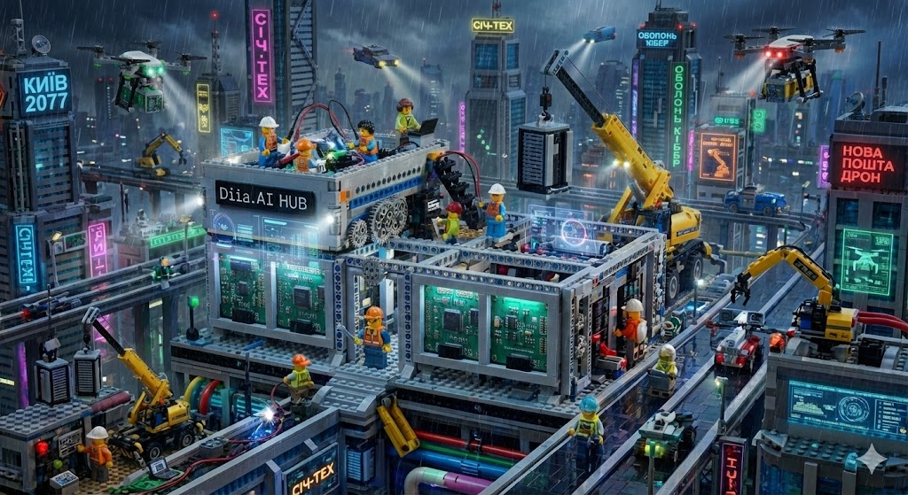

# LEGO-Diia Dual Mode System

**Kyiv 2077 x Diia.AI HUB** - vizualizatsiia kontseptsii modulnoi zbirky derzhavnykh servisiv

## Shcho tse?

LEGO-Diia - revoliutsiina systema vizualnoho konstruiuvannia derzhavnykh tsyfrovykh posluh Ukrainy. Pratsiuie u dvokh rezhymakh dlia riznykh potreb.

## Hackathon Mode

Shvydke prototypuvannia dlia demonstratsii ta prezentatsii.

- HTML/CSS mockups - heneratsiia za sekundy
- Figma eksport - hotovi makety dlia dyzaineriv
- Interaktyvni prototypy - bez backend, tilky UI
- Shareable posilannia - myttievi demo dlia zhuri

## Production Mode

Povnotsinnyi kod dlia realnykh derzhavnykh servisiv.

- Next.js/React - production-ready komponenty
- TypeScript - povna typizatsiia
- API intehratsiia - NAIS, YouControl, Data.gov.ua, Diia.Signature
- Docker - hotovyi do deployment
- Blockchain audit - prozorist kozhnoi dii

## Komponenty

| Komponent | Hackathon | Production |
|-----------|:---------:|:----------:|
| DiiaHeader | Yes | Yes |
| DiiaButton | Yes | Yes |
| DiiaInput | Yes | Yes |
| DiiaSignature | Mock | Real API |
| DiiaRegistry | Mock | Real API |

## Vykorystannia

1. Vidkryite `/lego` v dodatku
2. Peretiahit komponenty na canvas
3. Oberit rezhym: Hackathon abo Production
4. Eksportuyte rezultat

---

*Diia.AI Hackathon 2025*
