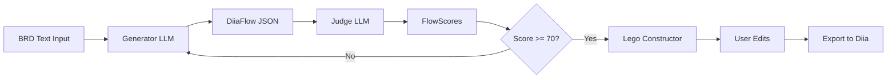

# 🔄 Flow Data Model

**Структура Даних для User Flows у Yana.Diia.AI**  
**Дата:** 23.11.2025

---

## 🎯 Призначення

Стандартизована структура для:

- ✅ Збереження згенерованих flows
- ✅ Передачі між Generator → Judge → Frontend
- ✅ Відображення в Lego-Diia Constructor
- ✅ Експорту в diia-open-source формат

---

## 📋 JSON Schema

### Root Object: DiiaFlow

```typescript
interface DiiaFlow {
  // Metadata
  flow_id: string;              // UUID
  service_name: string;          // e.g. "fop_registration"
  service_name_ua: string;       // "Реєстрація ФОП"
  created_at: string;            // ISO 8601
  created_by: "generator" | "manual";
  
  // Flow data
  steps: FlowStep[];
  total_steps: number;
  
  // Validation
  scores?: FlowScores;
  status: "draft" | "validated" | "approved" | "deployed";
  
  // Integration
  required_apis: string[];       // ["edr", "tax", "diia_signature"]
  deeplinks: Record<string, string>;
}
```

---

### FlowStep

```typescript
interface FlowStep {
  step_id: number;               // 1, 2, 3...
  step_type: StepType;
  component: DiiaComponent;
  
  // Display
  title_ua: string;              // "Перевірка права"
  description_ua?: string;
  
  // Logic
  api_calls?: ApiCall[];
  validation_rules?: ValidationRule[];
  conditional_logic?: ConditionalLogic;
  
  // Navigation
  next_step?: number | "conditional";
  prev_step?: number;
  can_skip: boolean;
}

type StepType = 
  | "api_check"      // Виклик API, показ результату
  | "form"           // Форма з полями
  | "signature"      // Дія.Підпис
  | "confirmation"   // Фінальний екран
  | "redirect";      // Перехід на інший сервіс
```

---

### DiiaComponent

```typescript
interface DiiaComponent {
  component_name: string;        // "eligibility_banner"
  props: Record<string, any>;    // Component-specific props
  
  // Optional overrides
  custom_styles?: CSSProperties;
  accessibility_overrides?: A11yOptions;
}

// Example
const exampleComponent: DiiaComponent = {
  component_name: "eligibility_banner",
  props: {
    eligible: true,
    title: "Ви маєте право на реєстрацію ФОП",
    message: "Перевірка через ЄДР пройдена успішно",
    actionLabel: "Продовжити"
  }
};
```

---

### ApiCall

```typescript
interface ApiCall {
  api_type: "edr" | "tax" | "vehicle" | "diia_docs" | "subsidy";
  endpoint: string;
  method: "GET" | "POST";
  
  // Parameters
  params: Record<string, string | number>;
  
  // Response handling
  response_mapping: Record<string, string>;  // Map API fields to UI fields
  error_handling: {
    on_404: "show_error" | "skip_step" | "use_default";
    on_500: "retry" | "show_unavailable";
  };
}

// Example
const exampleApiCall: ApiCall = {
  api_type: "edr",
  endpoint: "/api/mock/edr/{edrpou}",
  method: "GET",
  params: {
    edrpou: "{{user.inn}}"  // Template variable
  },
  response_mapping: {
    "name": "company_name",
    "status": "registration_status"
  },
  error_handling: {
    on_404: "show_error",
    on_500: "show_unavailable"
  }
};
```

---

### ValidationRule

```typescript
interface ValidationRule {
  field_name: string;
  rule_type: "required" | "regex" | "length" | "custom";
  rule_value: string | number | RegExp;
  error_message_ua: string;
}

// Example
const innValidation: ValidationRule = {
  field_name: "inn",
  rule_type: "regex",
  rule_value: /^\d{10}$/,
  error_message_ua: "РНОКПП має містити 10 цифр"
};
```

---

### FlowScores (Judge Output)

```typescript
interface FlowScores {
  // Individual scores (0-100)
  flow_length_score: number;          // 25% weight
  component_compliance_score: number; // 30% weight
  wcag_score: number;                 // 20% weight
  screen_saturation_score: number;    // 15% weight
  api_dependency_score: number;       // 10% weight
  
  // Total
  total_score: number;                // Weighted average
  passed: boolean;                    // >= 70
  
  // Feedback
  issues: Issue[];
  suggestions: string[];
}

interface Issue {
  severity: "error" | "warning" | "info";
  step_id: number;
  message_ua: string;
  fix_suggestion?: string;
}
```

---

## 📄 Complete Example: FOP Registration

```json
{
  "flow_id": "f47ac10b-58cc-4372-a567-0e02b2c3d479",
  "service_name": "fop_registration",
  "service_name_ua": "Реєстрація ФОП",
  "created_at": "2025-11-23T04:30:00Z",
  "created_by": "generator",
  "total_steps": 4,
  "required_apis": ["edr", "tax"],
  "status": "validated",
  
  "steps": [
    {
      "step_id": 1,
      "step_type": "api_check",
      "title_ua": "Перевірка права на реєстрацію",
      "component": {
        "component_name": "eligibility_banner",
        "props": {
          "eligible": "{{api.edr.can_register}}",
          "title": "Перевірка статусу в ЄДР",
          "message": "Перевіряємо чи немає діючої реєстрації..."
        }
      },
      "api_calls": [
        {
          "api_type": "edr",
          "endpoint": "/api/mock/edr/{inn}",
          "method": "GET",
          "params": {"inn": "{{user.inn}}"},
          "response_mapping": {
            "status": "edr_status"
          },
          "error_handling": {
            "on_404": "skip_step",
            "on_500": "show_unavailable"
          }
        }
      ],
      "next_step": 2,
      "can_skip": false
    },
    
    {
      "step_id": 2,
      "step_type": "form",
      "title_ua": "Оберіть вид діяльності",
      "description_ua": "Вкажіть КВЕД та систему оподаткування",
      "component": {
        "component_name": "form_step",
        "props": {
          "stepNumber": 2,
          "totalSteps": 4,
          "fields": [
            {
              "name": "kved",
              "type": "autocomplete",
              "label": "КВЕД",
              "options_api": "/api/kved/search"
            },
            {
              "name": "tax_system",
              "type": "radio",
              "label": "Система оподаткування",
              "options": [
                {"value": "simplified_2", "label": "Спрощена, група 2"},
                {"value": "simplified_3", "label": "Спрощена, група 3"},
                {"value": "general", "label": "Загальна"}
              ]
            }
          ]
        }
      },
      "validation_rules": [
        {
          "field_name": "kved",
          "rule_type": "required",
          "rule_value": true,
          "error_message_ua": "Оберіть хоча б один КВЕД"
        }
      ],
      "next_step": 3,
      "prev_step": 1,
      "can_skip": false
    },
    
    {
      "step_id": 3,
      "step_type": "signature",
      "title_ua": "Підпишіть заяву",
      "component": {
        "component_name": "diia_signature",
        "props": {
          "document_title": "Заява на реєстрацію ФОП",
          "document_preview_url": "/api/preview/fop-application"
        }
      },
      "next_step": 4,
      "prev_step": 2,
      "can_skip": false
    },
    
    {
      "step_id": 4,
      "step_type": "confirmation",
      "title_ua": "Заявку відправлено",
      "component": {
        "component_name": "success_banner",
        "props": {
          "title": "Готово!",
          "message": "Очікуйте рішення протягом 24 годин",
          "next_steps": [
            {
              "label": "Перейти до послуг",
              "deeplink": "/services"
            }
          ]
        }
      },
      "next_step": null,
      "prev_step": null,
      "can_skip": false
    }
  ],
  
  "scores": {
    "flow_length_score": 90,
    "component_compliance_score": 95,
    "wcag_score": 85,
    "screen_saturation_score": 80,
    "api_dependency_score": 85,
    "total_score": 88,
    "passed": true,
    "issues": [],
    "suggestions": [
      "Розглянути можливість автоматичного вибору найпопулярнішого КВЕД для IT"
    ]
  },
  
  "deeplinks": {
    "start": "/services/fop-registration",
    "step_1": "/services/fop-registration?step=1",
    "step_2": "/services/fop-registration?step=2"
  }
}
```

---

## 🔄 Data Flow in Yana.Diia.AI



---

## 💾 Storage

### PostgreSQL Schema

```sql
CREATE TABLE flows (
    flow_id UUID PRIMARY KEY,
    service_name VARCHAR(255),
    service_name_ua VARCHAR(255),
    created_at TIMESTAMP,
    created_by VARCHAR(50),
    flow_data JSONB,  -- Store entire DiiaFlow
    total_score DECIMAL(5,2),
    status VARCHAR(50),
    INDEX idx_service (service_name),
    INDEX idx_status (status)
);

CREATE TABLE flow_versions (
    version_id UUID PRIMARY KEY,
    flow_id UUID REFERENCES flows(flow_id),
    version_number INT,
    flow_data JSONB,
    created_at TIMESTAMP
);
```

### Mock Mode (JSON Files)

```bash
backend/mocks/flows/
├── fop_registration.json
├── subsidy_application.json
└── vehicle_registration.json
```

---

## 🎨 Frontend Integration

### Lego Constructor Display

```typescript
// components/lego-diia/canvas.tsx
import { DiiaFlow } from "@/types/flow";

export function LegoCanvas({ flow }: { flow: DiiaFlow }) {
  return (
    <div className="flow-canvas">
      {flow.steps.map((step) => (
        <StepCard
          key={step.step_id}
          step={step}
          onEdit={(updatedStep) => handleStepUpdate(step.step_id, updatedStep)}
        />
      ))}
    </div>
  );
}
```

---

## ✅ Checklist

- [ ] TypeScript interfaces defined
- [ ] JSON examples created for demo
- [ ] PostgreSQL schema created (or mock JSON files)
- [ ] Frontend can render flow from JSON
- [ ] Judge can score flow and update `scores` field
- [ ] Export to diia-open-source format working

---

**Статус:** ✅ Data Model Complete  
**Наступний крок:** Integration Testing
