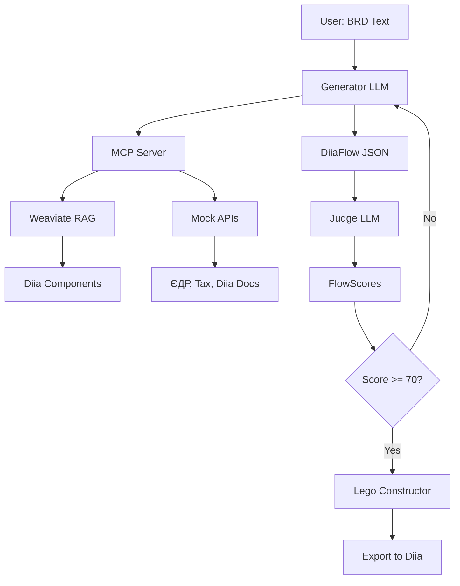

# 📚 Integration Documentation Index

**Yana.Diia.AI - Complete API & Data Integration Guide**  
**Created:** 23.11.2025, 06:10 EET  
**Status:** ✅ Ready for Implementation

---

## 🎯 Overview

Цей комплект документації містить всі необхідні специфікації для інтеграції Yana.Diia.AI з державними API України та внутрішніми системами (RAG, MCP, Database).

---

## 📄 Documents

### 1. [UKRAINE-API-REGISTRY.md](./UKRAINE-API-REGISTRY.md)

**Реєстр Державних API України**

Що включено:

- ✅ 6 категорій API (ЄДР, Податкова, Diia Docs, Транспорт, Субсидії, Земля)
- ✅ Mock server setup (FastAPI)
- ✅ BFF (Backend for Frontend) security pattern
- ✅ Request/Response примери для кожного API

**Ключові API:**

- **ЄДР** - Перевірка статусу ФОП/ТОВ
- **Tax API** - Податкові борги, декларації
- **Diia Documents** - Паспорт, права, COVID-сертифікат
- **Vehicle Registry** - Дані про авто
- **Subsidies** - Право на субсидії
- **Land Cadastre** - Земельні ділянки

---

### 2. [MCP-SERVER-SPEC.md](./MCP-SERVER-SPEC.md)

**Model Context Protocol Server Specification**

Що включено:

- ✅ 3 MCP Tools (Component Search, API Caller, Flow Validator)
- ✅ Integration з Generator (Llama 3.1) та Judge (GPT-4)
- ✅ Weaviate RAG для Diia Design System
- ✅ Security setup (auth tokens, env vars)

**MCP Tools:**

1. `search_diia_component(query)` - Знайти правильний UI компонент
2. `call_ukraine_api(type, id)` - Викликати державний API
3. `validate_flow(flow_json)` - Оцінити flow за Diia Rubric

---

### 3. [COMPONENT-DATABASE-SCHEMA.md](./COMPONENT-DATABASE-SCHEMA.md)

**Weaviate Vector Database Schema**

Що включено:

- ✅ Schema для DiiaComponent (Weaviate class)
- ✅ 5 критичних компонентів (eligibility_banner, error_modal, recipient_card_single, unavailable_banner, form_step)
- ✅ Indexing script (Python)
- ✅ Search query examples (semantic similarity)

**Critical Components:**

- `eligibility_banner` - Результат API перевірки права
- `error_modal` - Критичні помилки
- `recipient_card_single` - Дані отримувача з API
- `unavailable_banner` - Сервіс недоступний
- `form_step` - Багатокрокові форми

---

### 4. [FLOW-DATA-MODEL.md](./FLOW-DATA-MODEL.md)

**JSON Data Model для User Flows**

Що включено:

- ✅ TypeScript interfaces (DiiaFlow, FlowStep, ApiCall, FlowScores)
- ✅ Повний приклад flow для "Реєстрація ФОП"
- ✅ PostgreSQL schema для збереження
- ✅ Data flow diagram (Generator → Judge → Frontend)

**Key Interfaces:**

- `DiiaFlow` - Root object (metadata, steps, scores)
- `FlowStep` - Окремий крок (type, component, API calls)
- `ApiCall` - Виклик державного API
- `FlowScores` - Результат Judge оцінки (0-100)

---

## 🚀 Quick Start

### 1. Mock APIs Running

```bash
cd backend
uvicorn api.mock_registry:app --reload --port 8000
```

### 2. Weaviate Vector DB

```bash
docker run -d -p 8080:8080 semitechnologies/weaviate:latest
python backend/scripts/index_components.py
```

### 3. MCP Server

```bash
python backend/mcp/server.py  # Port 8001
```

### 4. LLM Setup

```bash
# Generator (Ollama)
ollama pull llama3.1
ollama serve  # Port 11434

# Judge (OpenAI)
# Set OPENAI_API_KEY in backend/.env
```

---

## 🎬 Demo Day Flow

### Scenario: "Реєстрація ФОП для IT-фрілансера"

**1. User Input (BRD):**

```
"Хочу зареєструватися як ФОП для надання IT-послуг"
```

**2. Generator (via MCP):**

- Викликає `search_diia_component("форма реєстрації ФОП")` → `form_step`
- Викликає `call_ukraine_api("edr", "1234567890")` → Перевірка статусу
- Генерує 4-крокоий flow

**3. Judge Validates:**

```json
{
  "total_score": 88,
  "breakdown": {
    "flow_length_score": 90,
    "component_compliance_score": 95,
    "wcag_score": 85,
    "screen_saturation_score": 80,
    "api_dependency_score": 85
  },
  "passed": true
}
```

**4. Frontend Displays:**

- Lego Constructor з 4 кроками
- Drag-and-drop editing
- Live preview з Diia Design System

---

## 🔐 Security Checklist

- [ ] `.env` files NOT committed (in `.gitignore`)
- [ ] BFF pattern used (API keys on backend)
- [ ] Mock mode active for Demo Day (zero costs)
- [ ] WCAG 2.1 AA enforced in all components
- [ ] Diia.Signature for authentication

---

## 📊 Architecture Diagram



---

## ✅ Implementation Checklist

### Backend

- [ ] Mock registry running (`uvicorn api.mock_registry:app`)
- [ ] Weaviate indexed with 5+ components
- [ ] MCP server with 3 tools registered
- [ ] PostgreSQL schema created (or mock JSON files)

### AI Layer

- [ ] Ollama + Llama 3.1 running
- [ ] OpenAI API key in `.env`
- [ ] Dual-LLM orchestration tested
- [ ] Judge rubric scoring working

### Frontend

- [ ] Lego Constructor rendering flows
- [ ] Diia Design System components
- [ ] API client with BFF pattern
- [ ] Flow export to JSON working

### Demo Day

- [ ] 5-minute presentation script
- [ ] Live demo: FOP registration flow
- [ ] Fallback video recorded
- [ ] Q&A answers prepared

---

## 📞 Contact & Support

**Project:** Yana.Diia.AI  
**Team:** Be Transparent (010io)  
**Contest:** Diia.AI Contest 2025  
**Deadline:** 29.11.2025, 23:59 EET  
**GitHub:** <https://github.com/Be-Transparent/Yana.Diia>

---

**Status:** 🟢 ALL DOCUMENTATION COMPLETE  
**Next Steps:** Begin implementation following `TECHNICAL_ARCHITECTURE.md` timeline
